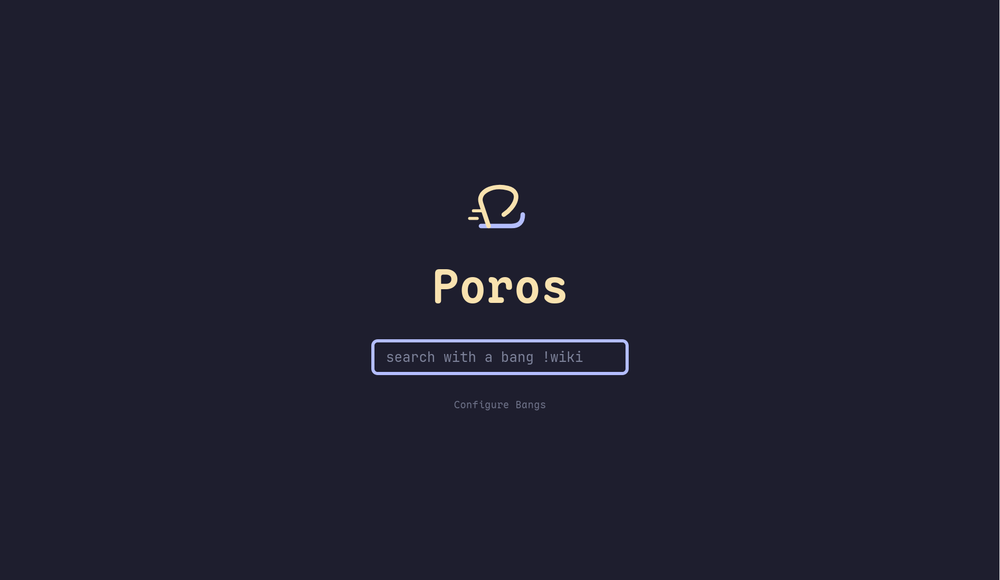

<div align="center">
  
  <h1>Poros</h1>
  <p>
    <strong>A lightning-fast, client-side search redirector.</strong><br>
    Written in Rust 🦀 and WebAssembly 🕸️
  </p>

  <p>
    <a href="https://pseudofractal.github.io/Poros/"><strong>Try it Live</strong></a>
  </p>
</div>

---



## 📖 About

**Poros** (from the Greek word for "passage") is a privacy-focused, client-side tool that brings "bangs" (shortcuts like `!yt`, `!w`, `!g`) to any browser. 

Unlike other redirectors, **Poros runs entirely in your browser**. Once loaded, it requires no backend server to process your queries. Your search habits stay on your device.

It is built with [Rust](https://www.rust-lang.org/) and and [WebAssembly](https://webassembly.org/), making it incredibly lightweight and performant.

## ✨ Features

* **⚡ Zero Latency:** Redirects happen instantly in the client; no server round-trips.
* **🔒 Private:** No backend tracking. Your queries never leave your browser until they hit the target site.
* **⚙️ Customizable:** Add, edit, or delete your own bangs via the Settings UI.
* **💾 Persistent:** Your custom bangs are saved locally in your browser.

---

## ☁️ Deploy Your Own

Want your own private version of Poros? You can fork this repository and have it running in under 2 minutes.

1.  **Fork this Repository** (Click the "Fork" button at the top right).
2.  **Enable Workflows:** Go to the **Actions** tab in your new repository and enable workflows if asked.
3.  **Wait:** The `Deploy` action will run automatically.
4.  **Configure Pages:**
    * Go to **Settings** > **Pages**.
    * Under **Build and deployment** > **Source**, ensure "Deploy from a branch" is selected.
    * Set **Branch** to `gh-pages` and folder to `/ (root)`.
    * Click **Save**.

🎉 **Voila!** The link in this README (above) will automatically update to point to your new instance once the actions finish running.

---

## 🚀 Usage

### Setting as Default Search Engine

To use Poros effectively, you should set it as your default search engine or a custom search shortcut.

#### **Chrome / Edge / Brave**
1.  Go to **Settings** > **Search engine** > **Manage search engines and site search**.
2.  Next to "Site search", click **Add**.
3.  Fill in the fields:
    * **Name:** `Poros`
    * **Shortcut:** `p` (or `!` if your browser allows it)
    * **URL:** `https://pseudofractal.github.io/Poros/?query=%s`
4.  (Optional) Click the three dots next to the new entry and select **Make default**.

#### **Firefox**
1.  Navigate to [https://pseudofractal.github.io/Poros/](https://pseudofractal.github.io/Poros/).
2.  Right-click the address bar.
3.  Select **"Add 'Poros'..."** (OpenSearch auto-discovery).
4.  *Alternatively:* Bookmark the page, right-click the bookmark, select **Properties**, and add a **Keyword** (e.g., `p`). You can then type `p !yt rust tutorials` in your URL bar.

---

## 🛠️ Development

To build or modify Poros, you need Rust and the `trunk` build tool.

### Prerequisites
1.  Install Rust: https://rustup.rs/
2.  Install the Wasm target:
    ```bash
    rustup target add wasm32-unknown-unknown
    ```
3.  Install Trunk:
    ```bash
    cargo install --locked trunk
    ```

### Running Locally
```bash
# Start a local development server with hot-reloading
trunk serve

```

Open your browser to `http://127.0.0.1:8080/Poros/`.

### Building for Production

```bash
# Build optimized assets for release
trunk build --release

```

The output will be in the `dist/` folder, ready to be deployed to GitHub Pages or any static host.

---

## 🤝 Credits

Inspiration drawn from:

* [Unduck](https://github.com/t3dotgg/unduck)
* [Rebang](https://github.com/Void-n-Null/rebang)
* DuckDuckGo's Bang System
